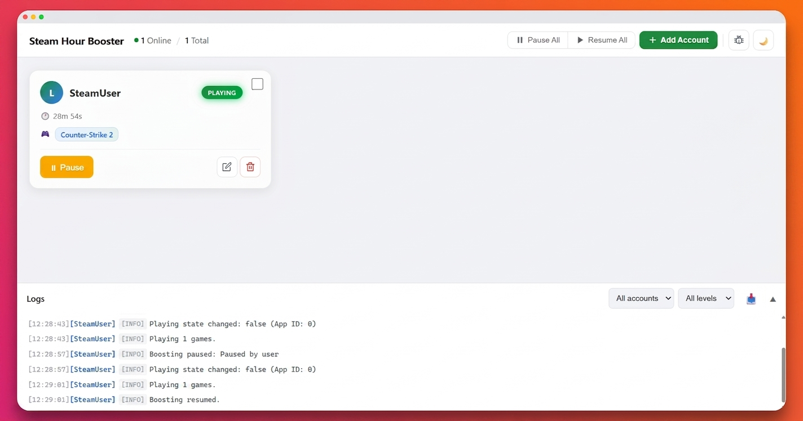
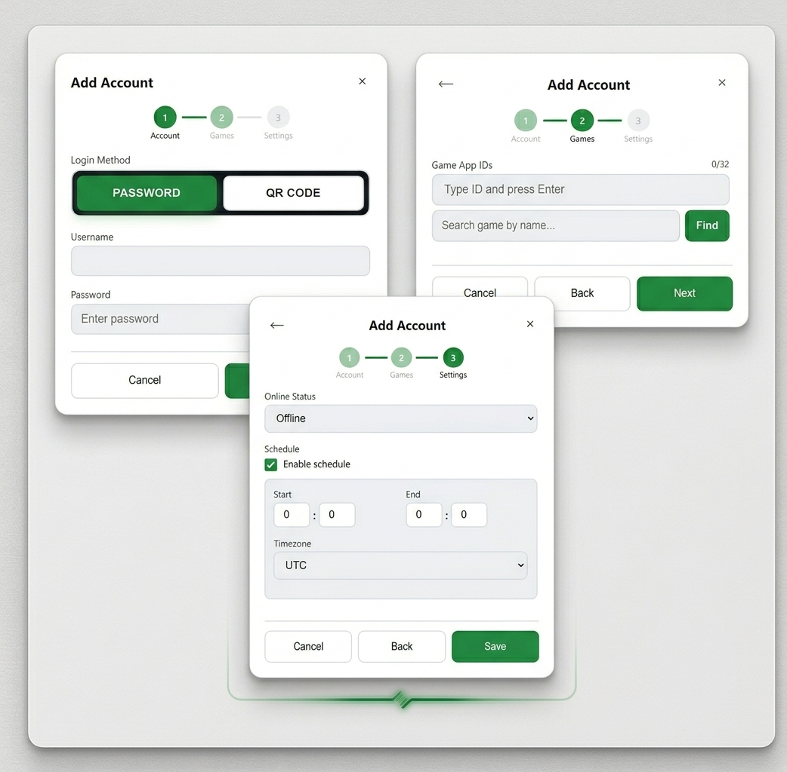

# steam-hour-booster
> Farm your in-game hours on Steam
- You can farm hours for **multiple games** on **multiple accounts** at once.
- Accounts with **Steam Guard** enabled are **supported**.
- **GUI panel** with real-time monitoring, account management, QR login, and Steam Guard input.
- Uses [node-steam-user](https://github.com/DoctorMcKay/node-steam-user) library.

<sub>*This software is not affiliated with Valve Corporation or Steam.*</sub>

### GUI Panel

<p align="center">
  
</p>

## Table of contents
- [Requirements](#requirements)
- [Quick start](#quick-start)
- [GUI Panel](#gui-panel)
- [Telegram Bot](#telegram-bot)
- [Configuration](#configuration)
- [Environment variables](#environment-variables)
- [HTTPS / Domain](#https--domain)
- [Docker](#docker)
- [Error handling](#error-handling)
- [FAQ](#faq)

## Requirements
- [Bun](https://bun.sh/) (or [Docker](https://www.docker.com/))

## Quick start

Install dependencies:
```bash
bun install
```

Copy config:
```bash
cp config-example.json config.json
```

Run:
```bash
bun .
```

Open GUI: **http://localhost:3000/**

### First login
1. Add an account in GUI (or edit `config.json`)
2. For **credentials** mode: enter username/password, Steam Guard code will be asked in GUI or console
3. For **QR code** mode: click "QR Login" on the account card, scan QR with Steam Mobile App
4. Once logged in, a [refresh token](https://github.com/DoctorMcKay/node-steam-user?tab=readme-ov-file#using-refresh-tokens) is stored — no need to enter codes again

## GUI Panel

Open **http://localhost:3000/** in your browser.

### Features
- **Dashboard** — real-time status of all accounts (Playing, Paused, Logged Out)
- **Add / Edit / Delete** accounts without restarting
- **Pause / Resume** boosting per account or all at once
- **QR Login** — scan QR code from the GUI (auto-refreshes every 30 seconds)
- **Steam Guard** — enter Steam Guard codes directly in the GUI
- **Live logs** — color-coded, filterable by level and username, collapsible on mobile
- **Online Status** — set accounts to Online or Offline in Steam
- **Game search** — search Steam store by name, click to add App ID
- **Boosting schedule** — auto-pause/resume by time of day with timezone support
- **Log export** — download logs as .txt file
- **Bug report** — one-click download of system info template
- **Dark / Light theme** — toggle with ☀️/🌙 button, saved in localStorage
- **Mobile responsive** — full-screen modals, FAB for quick actions, bottom sheet menus
- **Bulk operations** — select multiple accounts, pause/resume/delete in bulk
- **Drag-to-reorder** — reorder game IDs by dragging, first = main Steam status game

### Account card
| Button | Action |
| --- | --- |
| **Pause** | Stops boosting, sets Steam status to Offline |
| **Resume** | Continues boosting with saved settings |
| **Edit** | Change password, games, online status, login method |
| **QR Login** | Show QR code for login (only for `qrcode` accounts) |
| **Delete** | Remove account from config |

### Add / Edit account

<p align="center">
  
</p>

Multi-step wizard with game search, drag-to-reorder, and boosting schedule.

### Form wizard (3 steps)
1. **Account** — Login Method, Username, Password
2. **Games** — App IDs with search, drag-to-reorder (max 32)
3. **Settings** — Online Status, Boosting Schedule

## Telegram Bot

Optional Telegram bot for notifications and remote control.

### Setup
1. Create a bot via [@BotFather](https://t.me/BotFather) and get the token
2. Add to `.env`:
```env
TELEGRAM_BOT_TOKEN=your_bot_token
TELEGRAM_CHAT_ID=your_chat_id
```
3. Restart the bot. Send `/start` to your bot in Telegram.

### Features
- **Notifications** — error, session expired, kicked, reconnected alerts
- **Inline menus** — button-based UI, no commands needed
- **Status** — view all accounts with game names and uptime
- **Control** — pause/resume individual accounts or all at once
- **Logs** — filter by time (1h, 6h, 24h, 7d, All) with error/warn counts

### Commands (via buttons)
| Button | Action |
| --- | --- |
| 📊 Status | All accounts status with games |
| 📋 Accounts | List accounts |
| ⏸ Pause All | Pause all accounts |
| ▶ Resume All | Resume all accounts |
| 📝 Logs | View logs with time filter |

## Configuration

Configuration is a JSON file with a list of accounts.

```jsonc
[
    {
        "username": "your_username",
        "password": "your_password",
        "games": [730],
        "online": true,
        "loginMethod": "credentials"
    }
]
```

### Fields
| Field | Type | Required | Description |
| --- | --- | --- | --- |
| `username` | string | Yes | Steam username |
| `password` | string | For credentials | Steam password (not needed for QR login) |
| `games` | number[] | Yes | Game App IDs to farm (max 32). Find IDs on [SteamDB](https://steamdb.info/) |
| `online` | boolean | No | Appear online & in-game (default: `false`) |
| `loginMethod` | string | No | `"credentials"` (default) or `"qrcode"` |
| `schedule` | object | No | Boosting schedule (see below) |

### Schedule
Auto-pause and resume boosting by time of day:

```jsonc
{
    "schedule": {
        "enabled": true,
        "startHour": 8,
        "startMinute": 0,
        "endHour": 22,
        "endMinute": 0,
        "timezone": "Europe/Warsaw"
    }
}
```

The bot will automatically pause outside the time window and resume within it. Timezone supports any valid IANA timezone.

## Environment variables
You can provide a `.env` file to configure environment variables.

Copy the template:
```bash
cp .env.template .env
```

| Name | Description | Default |
| --- | --- | --- |
| `CONFIG_PATH` | Path to config file | `./config.json` |
| `STEAM_DATA_DIRECTORY` | Steam data storage path | `./steam-data` |
| `TOKEN_STORAGE_DIRECTORY` | Refresh tokens storage path | `./tokens` |
| `MONITOR_PORT` | GUI server port | `3000` |
| `GUI_USERNAME` | Basic Auth username (optional) | — |
| `GUI_PASSWORD` | Basic Auth password (optional) | — |
| `GUI_DOMAIN` | Domain name for HTTPS (optional) | — |
| `GUI_CERT_FILE` | Path to SSL certificate (optional) | — |
| `GUI_KEY_FILE` | Path to SSL private key (optional) | — |
| `TELEGRAM_BOT_TOKEN` | Telegram bot token (optional) | — |
| `TELEGRAM_CHAT_ID` | Telegram chat ID for admin (optional) | — |

> **Security:** If you expose the GUI to the internet, always set `GUI_USERNAME` and `GUI_PASSWORD` to protect your accounts.

## HTTPS / Domain

For production, you can run with a domain and SSL certificates directly (no nginx needed):

```bash
GUI_DOMAIN=boost.example.com \
GUI_CERT_FILE=/etc/letsencrypt/live/boost.example.com/fullchain.pem \
GUI_KEY_FILE=/etc/letsencrypt/live/boost.example.com/privkey.pem \
MONITOR_PORT=443 \
bun .
```

Or via `.env`:
```env
MONITOR_PORT=443
GUI_DOMAIN=boost.example.com
GUI_CERT_FILE=/etc/letsencrypt/live/boost.example.com/fullchain.pem
GUI_KEY_FILE=/etc/letsencrypt/live/boost.example.com/privkey.pem
```

If you use **nginx proxy manager**, just run on default port 3000 and point your reverse proxy to `http://localhost:3000`.

## Docker

Build the Docker image from the repository:

```bash
git clone https://github.com/jokerms21/steam-hour-booster.git
cd steam-hour-booster
docker build -t steam-hour-booster .
```

Run:

```bash
docker run -d \
  -p 3000:3000 \
  -v ./config.json:/app/config.json \
  -v ./tokens:/app/tokens \
  -v ./steam-data:/app/steam-data \
  steam-hour-booster
```

> **Note:** The `tokens` and `steam-data` directories are auto-created if they don't exist.

### Docker with HTTPS

```yaml
services:
  steam-hour-booster:
    build: .
    ports:
      - "443:443"
    environment:
      - GUI_DOMAIN=boost.example.com
      - GUI_CERT_FILE=/certs/fullchain.pem
      - GUI_KEY_FILE=/certs/privkey.pem
      - MONITOR_PORT=443
    volumes:
      - ./config.json:/app/config.json
      - ./tokens:/app/tokens
      - ./steam-data:/app/steam-data
      - /etc/letsencrypt:/certs:ro
```

## Error handling

The bot handles common Steam errors automatically:

| Error | Code | Behavior |
| --- | --- | --- |
| **Expired** | eresult 27 | Deletes token, sets status to "Expired". Re-login via GUI required. |
| **LoggedInElsewhere** | eresult 6 | Retries every 3 minutes until account is free. Telegram notification. |
| **ServiceUnavailable** | eresult 20 | Exponential backoff retry (30s → 60s → ... → 300s max). |
| **NoConnection** | eresult 3 | Same as ServiceUnavailable — auto-retry with backoff. |

Global `uncaughtException` and `unhandledRejection` handlers prevent process crashes.

## FAQ

### Can I get banned?
People have been using these kinds of "hour boosters" for years, without issues.\
Don't take my word for it though, use at your own risk.

### Steam Guard code not showing in GUI?
If you refresh the page while the bot is waiting for Steam Guard, the modal will reappear automatically. If it doesn't, wait 5 seconds and it will fall back to console input.

### How to pause boosting?
Click **Pause** on the account card. The bot will stop playing games and appear offline in Steam. Click **Resume** to continue. You can also **Pause All** from the header button or FAB on mobile.

### What is the 32-game limit?
Steam only allows boosting 32 games simultaneously per account. The GUI shows a counter and prevents adding more.

### How does game search work?
Game search uses the Steam Store API (`storesearch`). Results are cached for 5 minutes. You can search by game name and click a result to add its App ID.

### How does the schedule work?
Set a start/end time and timezone in the schedule config. The bot checks every 60 seconds and auto-pauses/resumes based on the current time in your timezone.
